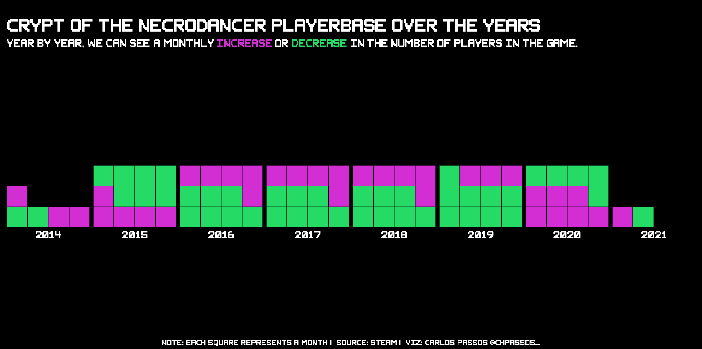
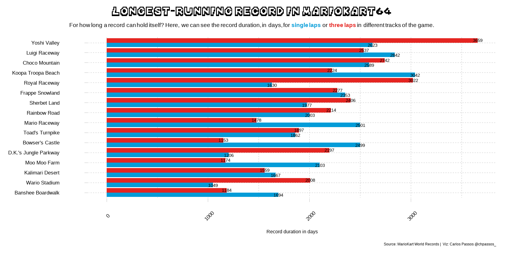
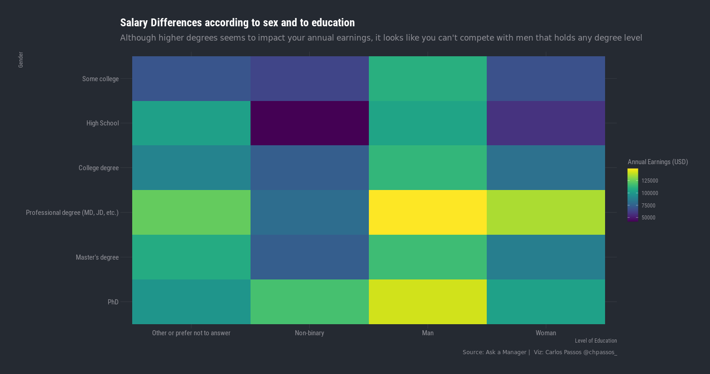

## TidyTuesday Visualizations

Code and plots of the submissions to the [#tidytuesday](https://github.com/rfordatascience/tidytuesday) challenge

### Highlights (click on image to go to code):  
---

 
  

	
	
	
	  
  	
  

